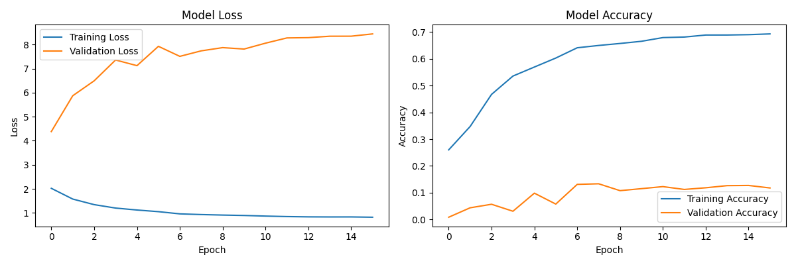

# EmoVision

EmoVision is a real-time emotion recognition project using deep learning. It captures video frames from a camera, detects faces, and predicts emotions in real-time.

## Features

- Real-time face detection and emotion recognition.
- Uses a trained deep learning model for accurate emotion predictions.
- Simple integration with OpenCV for video capture.

## Dataset

The model is trained on the [Face Expression Recognition Dataset](https://www.kaggle.com/datasets/jonathanoheix/face-expression-recognition-dataset) from Kaggle, which consists of 35 thousand images with labeled emotions.

**Processed Data can be downloaded from here: [emovision-google-drive](https://drive.google.com/drive/folders/1MIwS0kAWUqcRxHqpXzoPqQ73AsBSCPWy?usp=sharing)**

## Model Training

The model was trained for 100 epochs, and the final epoch's metrics are as follows:

- Training loss: 0.7405
- Training accuracy: 73.07%
- Validation loss: 1.0369
- Validation accuracy: 63.08%

The training process took a total of 6 hours and 34 minutes on a [2020 M1 MacBook Air](https://en.wikipedia.org/wiki/MacBook_Air_(Apple_silicon)).

**Trained Models can be downloaded from here: [emovision-google-drive](https://drive.google.com/drive/folders/1MIwS0kAWUqcRxHqpXzoPqQ73AsBSCPWy?usp=sharing)**

### GPU Training
GPU: NVIDIA RTX 3070
- cuDNN version 8.9.7.29 
- CUDA 11.8
- nvidia-driver-560
- Tensorflow version 2.12.0

OS: Ubuntu 22.0.4

### Training insights


## Getting Started

**Dependency: `python 3.11.9` others are mentioned in the `requirements.txt` file**

1. Clone the repository:
```bash
git clone https://github.com/adistrim/EmoVision.git
```
2. Setup virtual environment:
```bash
cd EmoVision
python3 -m venv .venv               # python or python3 depending on the system config
source .venv/bin/activate           # For Linux and macOS
```

3. Install required libraries:
```bash
pip3 install -r requirements.txt    # pip or pip3 depending on the system config
```
4. Execute the realtime.ipynb file.

5. Press 'Q' to end the program.

## License
This project is licensed under the [MIT License](https://www.mit.edu/~amini/LICENSE.md).
